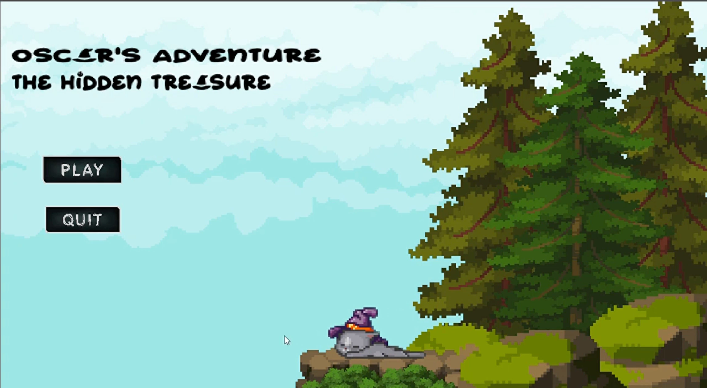
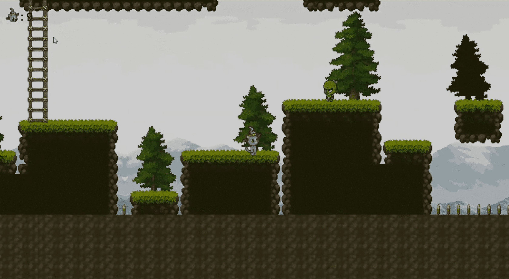

# Oscar's Adventure: The Hidden Treasure

## Setting:

- **Map 1:** Mystical Forest
- **Map 2:** Mystical Forest
- **Map 3:** Mysterious Cave
- **Map 4:** Ancient Temple

## Game Story:

Embark on a captivating journey with Oscar, an adventurous cat fascinated by mysterious forests. Oscar stumbles upon an ancient map leading to a dense forest rumored to conceal an ancient temple filled with treasures. Without hesitation, Oscar sets off on a thrilling quest to uncover the hidden treasure.

## Genre:

2D Platformer

## Game Engine:

Godot

## Development Team:

- Adjie Surya Nugraha
- Erdy Fitriansyah
- Ramdhanu Britan Linardi
- Nestiawan Ferdiyanto
- Slamet Nugroho

## Special Thanks:

We extend our sincere appreciation to the skilled creators whose game assets have played a pivotal role in enhancing our project, contributing substantially to the creation of Oscar's Adventure: The Hidden Treasure.

A heartfelt thank you goes out to the entire development team and asset contributors for their dedication and efforts, making Oscar's Adventure: The Hidden Treasure an unforgettable experience. We hope players thoroughly immerse themselves in the excitement of Oscar's quest for hidden riches in this intricately crafted world.
